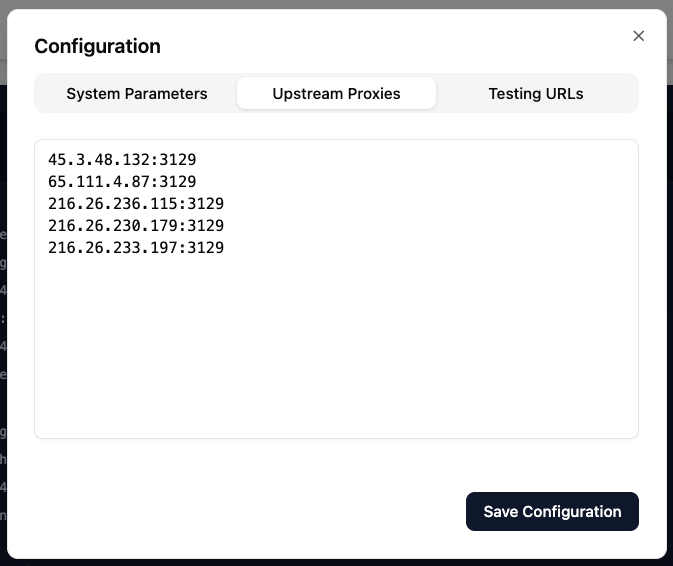
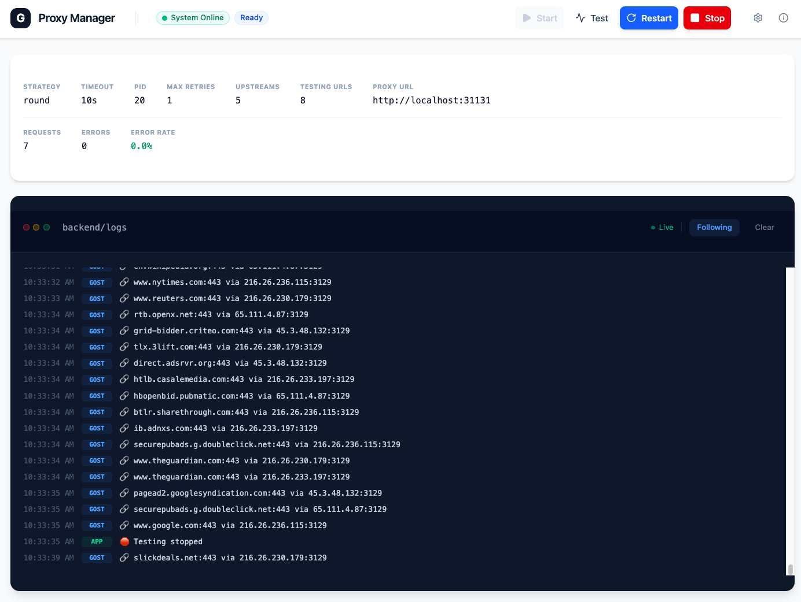

# GOST Rotating Proxy Manager

An **all-in-one** solution that bundles the **GOST** (GO Simple Tunnel) proxy with a modern Web UI and REST API into a single, installable **Docker image**, providing a self-contained environment for rotating proxy server with one docker command.

## Quick Start

```bash
docker run -d \
  --name gost-proxy-manager \
  -p 31130:31130 \
  -p 31131:31131 \
  -v gost_proxy_manager_data:/app/data \
  ghcr.io/mchen-lab/gost-proxy-manager:dev
```

> **Note:** You can also use the Docker Hub image: `docker.io/xychenmsn/gost-proxy-manager:latest`

Navigate to [http://localhost:31130](http://localhost:31130) to access the UI.

## Common Usage Scenario

**"I need a rotating proxy system for web crawling."**

Instead of configuring rotation logic in your crawler, add your upstream proxies here and point your crawler to the **single** entry point. The manager handles rotation and load balancing for you.





## Current Status

✅ **Production Ready**: Fully functional with Docker support
✅ **Hot Reload**: Integrated Vite HMR + Node watch for smooth development
✅ **Proxy Management**: Easy add/edit/delete of upstream proxies
✅ **Traffic Routing**: Smart routing through proxy chains
✅ **Observability**: Real-time log viewing and status monitoring

## Features

- 🌐 **Proxy Management**: Manage a list of upstream proxies (SOCKS5, HTTP, etc.)
- 🧪 **Proxy Testing**: Built-in tools to verify proxy connectivity and speed
- 📊 **Log Viewer**: Real-time logs from both the manager and the underlying GOST instance
- 🔄 **Rotation**: Automatically rotate through available proxies
- 🛠️ **REST API**: Full programmatic control over proxy configurations
- 🐳 **Dockerized**: Easy deployment with Docker and Docker Compose

## Architecture

The system consists of three main components running in a single container:

1.  **Web UI (Port 31130)**: React-based dashboard for management.
2.  **Proxy Service (Port 31131)**: The actual GOST proxy entry point.
3.  **API Service (Port 31132)**: REST API for backend management.


## Configuration

### Environment Variables

- `PORT`: Web UI port (Internal default: 31130)
- `PROXY_PORT`: GOST proxy port (Internal default: 31131)
- `API_PORT`: API server port (Internal default: 31132)
- `GOST_ARGS`: Additional arguments for the GOST binary

### Data Persistence

All proxy configurations and application settings are in `settings.json` in `/app/data`.
Mount a volume to this path to persist data across container restarts:

```bash
-v gost_proxy_manager_data:/app/data
```

## Usage

1.  **Open the Web UI**: Navigate to `http://localhost:31130`.
2.  **Add Proxies**: Use the dashboard to add your upstream proxy credentials.
3.  **Connect**: Configure your applications to use `localhost:31131` as their proxy server.
4.  **Monitor**: Watch the logs in the UI to see traffic and rotation events.

## Screenshots

### Main Dashboard


### Settings


## Local Development

If you wish to run the application locally (outside of Docker) for development purposes (e.g. `npm run dev`), you **must** have the `gost` binary installed on your host machine.

1.  **Install GOST**: Download and install GOST v2 from the [official repository](https://github.com/ginuerzh/gost).
2.  **Verify Installation**: Ensure `gost` is in your system PATH (`gost -V`).
3.  **Run Development Server**:
    ```bash
    npm install
    npm run dev
    ```

The manager tries to spawn the `gost` process directly. In the Docker image, this is pre-packaged, but for local dev, you must provide it.

## License

MIT
